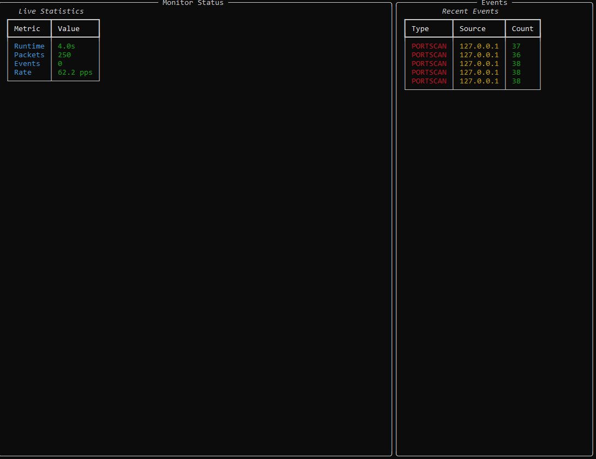

# Blue Team Toolkit

[](https://opensource.org/licenses/MIT)
[](https://www.python.org/downloads/)

A comprehensive defensive security monitor for home and lab networks. Blue Team Toolkit provides real-time packet capture, threat detection, and alerting capabilities to help identify suspicious network activity.

## 🛡️ Features

- **Real-time Packet Capture**: Monitor live network traffic with BPF filtering
- **Threat Detection**: Detect port scans, brute force attacks, and DoS patterns
- **Multi-platform Support**: Works on Linux and Windows with cross-platform compatibility
- **Flexible Alerting**: Send alerts via Slack webhooks or Telegram bots
- **Persistent Storage**: Store events in SQLite database with querying capabilities
- **Rich CLI Interface**: Beautiful command-line interface with real-time statistics
- **Offline Analysis**: Analyze existing PCAP files for forensic investigation
- **GeoIP Integration**: Optional geographic IP lookup for enhanced context
- **Configuration Management**: YAML-based configuration with validation

## 🏗️ Architecture

```
┌─────────────────┐    ┌──────────────────┐    ┌─────────────────┐
│   Packet        │    │   Threat         │    │   Alert         │
│   Capture       │───▶│   Analysis       │───▶│   Manager       │
│                 │    │                  │    │                 │
│ • Live/Offline  │    │ • Port Scan      │    │ • Slack         │
│ • BPF Filtering │    │ • Brute Force    │    │ • Telegram      │
│ • Multi-platform│    │ • DoS Detection  │    │ • Extensible    │
└─────────────────┘    └──────────────────┘    └─────────────────┘
         │                       │                       │
         ▼                       ▼                       ▼
┌─────────────────┐    ┌──────────────────┐    ┌─────────────────┐
│   Configuration │    │   SQLite         │    │   CLI           │
│   Management    │    │   Storage        │    │   Interface     │
│                 │    │                  │    │                 │
│ • YAML Config   │    │ • Event History  │    │ • Rich Output   │
│ • Validation    │    │ • Query Support  │    │ • Real-time     │
│ • Hot Reload    │    │ • Statistics     │    │ • Interactive   │
└─────────────────┘    └──────────────────┘    └─────────────────┘
```
## 📸 Screenshots

### Demo Mode


### Live Dashboard


### Portscan Traffic


### Alert Log


### Session Summary


### Events Table – DoS


### Events Table – Portscan


## 🚀 Quick Start

### Installation

```bash
# Clone the repository
git clone https://github.com/vanchungnguyxn/blue-team-toolkits.git
cd blue-team-toolkits

# Install with pip
pip install -e .

# Or install with optional dependencies
pip install -e ".[geoip,performance]"
```

### Basic Usage

```bash
# Initialize configuration and database
bluetool init

# Start monitoring (requires admin/root privileges for live capture)
bluetool start

# View recent events
bluetool show events --limit 20

# Check system status
bluetool status

# Validate configuration
bluetool config validate
```

### Demo Mode

Try Blue Team Toolkit without network access:

```bash
# Run demo with synthetic events
bluetool demo

# Or analyze a PCAP file
bluetool start --offline sample.pcap
```

## 📋 Requirements

### System Requirements

- **Python**: 3.10 or higher
- **Operating System**: Linux or Windows
- **Privileges**: Administrator/root access for live packet capture
- **Network**: Network interface for monitoring (or PCAP files for offline analysis)

### Windows Specific

- **Npcap**: Install [Npcap](https://nmap.org/npcap/) for packet capture support
- **PowerShell**: Run as Administrator for live capture
- **Visual C++**: Required for some Python packages

### Linux Specific

- **libpcap**: Install development headers (`libpcap-dev` on Ubuntu/Debian)
- **Root access**: Required for promiscuous mode and raw socket access

## ⚙️ Configuration

Blue Team Toolkit uses YAML configuration files. Create a default configuration:

```bash
bluetool init --config myconfig.yaml
```

### Configuration Schema

```yaml
version: 1
interface: auto  # Network interface or 'auto' for auto-selection

capture:
  bpf: "tcp or udp or icmp"  # Berkeley Packet Filter
  snaplen: 65535             # Maximum packet capture length
  promisc: true              # Promiscuous mode
  offline: false             # Offline mode for PCAP files

detection:
  portscan:
    window_sec: 5                    # Time window for detection
    unique_ports_threshold: 20       # Unique ports to trigger alert
  
  bruteforce:
    services: ["ssh", "http", "https"]  # Services to monitor
    window_sec: 60                      # Time window for detection
    fail_threshold: 10                  # Failed attempts to trigger alert
  
  dos:
    window_sec: 5           # Time window for detection
    packet_threshold: 500   # Packets per window to trigger alert

alerts:
  slack_webhook: ""         # Slack webhook URL (optional)
  telegram:
    bot_token: ""          # Telegram bot token (optional)
    chat_id: ""            # Telegram chat ID (optional)

persistence:
  db_path: "bluetool.db"   # SQLite database path

logging:
  level: "info"            # Log level (debug, info, warning, error)
  console: true            # Enable console logging
```

## 🔔 Alert Setup

### Slack Integration

1. Create a Slack webhook URL in your workspace
2. Add the webhook URL to your configuration:

```yaml
alerts:
  slack_webhook: "https://hooks.slack.com/services/YOUR/WEBHOOK/URL"
```

### Telegram Integration

1. Create a Telegram bot using [@BotFather](https://t.me/BotFather)
2. Get your chat ID by messaging [@userinfobot](https://t.me/userinfobot)
3. Add credentials to your configuration:

```yaml
alerts:
  telegram:
    bot_token: "YOUR_BOT_TOKEN"
    chat_id: "YOUR_CHAT_ID"
```

## 💾 Database Schema

Blue Team Toolkit stores events in SQLite with the following schema:

```sql
-- Events table
CREATE TABLE events (
    id TEXT PRIMARY KEY,           -- Event UUID
    type TEXT NOT NULL,            -- PORTSCAN, BRUTEFORCE, DOS
    src_ip TEXT NOT NULL,          -- Source IP address
    dst_ip TEXT,                   -- Destination IP address
    count INTEGER NOT NULL,        -- Event count/severity
    details TEXT DEFAULT '',       -- Additional details
    ts INTEGER NOT NULL,           -- Unix timestamp
    created_at TIMESTAMP DEFAULT CURRENT_TIMESTAMP
);

-- Metadata table
CREATE TABLE meta (
    k TEXT PRIMARY KEY,            -- Key
    v TEXT NOT NULL,               -- Value
    updated_at TIMESTAMP DEFAULT CURRENT_TIMESTAMP
);
```

### Querying Events

```bash
# Show recent events
bluetool show events --limit 50

# Filter by event type
bluetool show events --type PORTSCAN BRUTEFORCE

# Filter by source IP
bluetool show events --src-ip 192.168.1.100
```

### Direct SQL Access

```bash
# Open database with sqlite3
sqlite3 bluetool.db

# Example queries
SELECT type, COUNT(*) FROM events GROUP BY type;
SELECT * FROM events WHERE src_ip = '192.168.1.100' ORDER BY ts DESC;
SELECT DATE(ts, 'unixepoch') as date, COUNT(*) FROM events GROUP BY date;
```

## 🪟 Windows Installation Notes

### Installing Npcap

1. Download Npcap from [https://nmap.org/npcap/](https://nmap.org/npcap/)
2. Run installer as Administrator
3. Enable "Install Npcap in WinPcap API-compatible Mode"

### Running Blue Team Toolkit

```powershell
# Open PowerShell as Administrator
# Navigate to project directory
cd C:\path\to\blue-team-toolkit

# Install and run
pip install -e .
bluetool start
```

### Firewall Considerations

Windows Defender may block packet capture. Add exceptions for:
- Python executable
- Blue Team Toolkit directory
- Network interfaces used for monitoring

## 📊 Detection Rules

### Port Scan Detection

**Trigger**: Single source IP accesses multiple unique ports within time window

**Parameters**:
- `window_sec`: Time window in seconds (default: 5)
- `unique_ports_threshold`: Unique ports to trigger (default: 20)

**Example**: IP `192.168.1.100` scans ports 22, 23, 80, 443, 993, 995... (20+ ports in 5 seconds)

### Brute Force Detection

**Trigger**: Repeated authentication failures from single source IP

**Parameters**:
- `services`: Services to monitor (ssh, http, https, ftp, telnet)
- `window_sec`: Time window in seconds (default: 60)
- `fail_threshold`: Failures to trigger (default: 10)

**Detection Logic**:
- **SSH**: TCP RST packets to port 22
- **HTTP/HTTPS**: Multiple rapid connections to ports 80/443
- **Other services**: Connection patterns indicating auth failures

### DoS Detection

**Trigger**: High packet rate from single source IP

**Parameters**:
- `window_sec`: Time window in seconds (default: 5)
- `packet_threshold`: Packets to trigger (default: 500)

**Example**: IP `10.0.0.1` sends 750 packets in 5 seconds

## 🔧 Development

### Setting Up Development Environment

```bash
# Clone repository
git clone https://github.com/vanchungnguyxn/blue-team-toolkits.git
cd blue-team-toolkit

# Install in development mode with all dependencies
pip install -e ".[dev,geoip,performance]"

# Install pre-commit hooks
pre-commit install

# Run tests
pytest tests/ -v

# Run linting
make lint

# Fix linting issues
make lint-fix
```

### Project Structure

```
blue-team-toolkit/
├── src/bluetool/           # Main package
│   ├── __init__.py
│   ├── cli.py             # Command-line interface
│   ├── capture.py         # Packet capture
│   ├── analyze.py         # Threat detection
│   ├── alerts.py          # Alert management
│   ├── storage.py         # Database operations
│   ├── config.py          # Configuration management
│   ├── geoip.py           # GeoIP lookups
│   ├── utils.py           # Utility functions
│   └── demo/              # Demo files
├── tests/                 # Test suite
├── examples/              # Configuration examples
├── .github/workflows/     # CI/CD pipelines
├── requirements.txt       # Dependencies
├── pyproject.toml        # Package configuration
└── Makefile              # Development commands
```

### Running Tests

```bash
# Run all tests
pytest

# Run specific test file
pytest tests/test_config.py -v

# Run with coverage
pytest --cov=bluetool tests/

# Run integration tests (requires admin privileges)
pytest tests/test_integration.py -v
```

## 🐳 Docker Support

### Building Docker Image

```dockerfile
FROM python:3.11-slim

# Install system dependencies
RUN apt-get update && apt-get install -y \
    libpcap-dev \
    && rm -rf /var/lib/apt/lists/*

# Copy application
COPY . /app
WORKDIR /app

# Install Python dependencies
RUN pip install -e ".[geoip]"

# Note: Requires --cap-add=NET_RAW for packet capture
# For demo mode only: docker run bluetool bluetool demo
CMD ["bluetool", "demo"]
```

### Running in Docker

```bash
# Build image
docker build -t bluetool .

# Run demo (no special privileges needed)
docker run bluetool bluetool demo

# Run with packet capture (requires NET_RAW capability)
docker run --cap-add=NET_RAW --network=host bluetool bluetool start
```

## 🔒 Legal and Ethical Considerations

### ⚠️ IMPORTANT DISCLAIMER

Blue Team Toolkit is designed for **defensive security purposes only** and should be used exclusively in the following contexts:

- **Your own networks and systems**
- **Laboratory environments for educational purposes**
- **Networks where you have explicit written authorization**
- **Penetration testing with proper legal agreements**

### Legal Requirements

- **Authorization**: Only monitor networks you own or have explicit permission to monitor
- **Compliance**: Ensure compliance with local laws and regulations (GDPR, HIPAA, etc.)
- **Data Privacy**: Be mindful of capturing sensitive data in packet headers
- **Retention**: Implement appropriate data retention and deletion policies

### Ethical Guidelines

- **Responsible Disclosure**: Report vulnerabilities through proper channels
- **Minimal Impact**: Use minimal necessary privileges and resources
- **Documentation**: Maintain clear documentation of monitoring activities
- **Privacy**: Respect user privacy and data protection requirements

**The authors and contributors are not responsible for any misuse of this tool.**

## 🤝 Contributing

We welcome contributions! Please see our [Contributing Guidelines](CONTRIBUTING.md) for details.

### Ways to Contribute

- **Bug Reports**: Report issues with detailed reproduction steps
- **Feature Requests**: Suggest new features or improvements
- **Code Contributions**: Submit pull requests with tests and documentation
- **Documentation**: Improve documentation and examples
- **Testing**: Test on different platforms and configurations

### Development Workflow

1. Fork the repository
2. Create a feature branch (`git checkout -b feature/amazing-feature`)
3. Make your changes with tests
4. Run the test suite (`make test`)
5. Commit your changes (`git commit -m 'Add amazing feature'`)
6. Push to the branch (`git push origin feature/amazing-feature`)
7. Open a Pull Request

## 📜 License

This project is licensed under the MIT License - see the [LICENSE](LICENSE) file for details.

## 🙏 Acknowledgments

- **Scapy**: Powerful packet manipulation library
- **Rich**: Beautiful terminal formatting
- **Typer**: Modern CLI framework
- **MaxMind**: GeoIP database support
- **Security Community**: Inspiration and best practices

## 📞 Support

- **Issues**: [GitHub Issues](https://github.com/vanchungnguyxn/blue-team-toolkits/issues)
- **Discussions**: [GitHub Discussions](https://github.com/vanchungnguyxn/blue-team-toolkits/discussions)
- **Email**: [ngv.chungg@gmail.com](mailto:ngv.chungg@gmail.com)

---

**Blue Team Toolkit** - Defend your network with confidence! 🛡️
